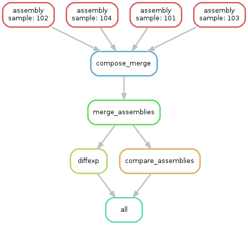
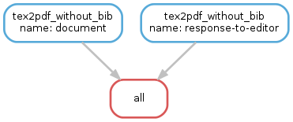

.. getting_started-examples:

========
示例
========

下面的大多数示例都假定Snakemake在特定项目的根目录中执行。下面的Snakefiles中的路径是相对于该目录的。我们遵循惯例为不同的中间结果使用不同的子目录，例如， ``mapped/``文件夹存放比对序列reads的 ``.bam``文件。

Cufflinks
=========

`Cufflinks <http://cole-trapnell-lab.github.io/cufflinks/>`_是用于RNA-seq数据转录本组装，计算丰度，差异表达分析的工具。本示例说明如何使用Snakemake创建典型的Cufflinks工作流。 假定将给定四个样本101-104的比对RNA-Seq数据bam文件。

* 对于每个样本，转录本使用 ``cufflinks``进行拼接组装(规则 ``assembly``)
* ``cuffmerge`` merge转录本gtf(规则 ``merge_assemblies``)
* 和hg19注释文件进行比较(规则 ``compare_assemblies``)
* 最后，根据找到的转录本计算差异表达(规则 ``diffexp``)

.. code-block:: python

    # path to track and reference
    TRACK   = 'hg19.gtf'
    REF     = 'hg19.fa'

    # sample names and classes
    CLASS1  = '101 102'.split()
    CLASS2  = '103 104'.split()
    SAMPLES = CLASS1 + CLASS2

    # path to bam files
    CLASS1_BAM = expand('mapped/{sample}.bam', sample=CLASS1)
    CLASS2_BAM = expand('mapped/{sample}.bam', sample=CLASS2)

    rule all:
        input:
            'diffexp/isoform_exp.diff',
            'assembly/comparison'

    rule assembly:
        input:
            'mapped/{sample}.bam'
        output:
            'assembly/{sample}/transcripts.gtf',
            dir='assembly/{sample}'
        threads: 4
        shell:
            'cufflinks --num-threads {threads} -o {output.dir} '
            '--frag-bias-correct {REF} {input}'

    rule compose_merge:
        input:
            expand('assembly/{sample}/transcripts.gtf', sample=SAMPLES)
        output:
            txt='assembly/assemblies.txt'
        run:
            with open(output.txt, 'w') as out:
                print(*input, sep="\n", file=out)

    rule merge_assemblies:
        input:
            'assembly/assemblies.txt'
        output:
            'assembly/merged/merged.gtf', dir='assembly/merged'
        shell:
            'cuffmerge -o {output.dir} -s {REF} {input}'

    rule compare_assemblies:
        input:
            'assembly/merged/merged.gtf'
        output:
            'assembly/comparison/all.stats',
            dir='assembly/comparison'
        shell:
            'cuffcompare -o {output.dir}all -s {REF} -r {TRACK} {input}'

    rule diffexp:
        input:
            class1=CLASS1_BAM,
            class2=CLASS2_BAM,
            gtf='assembly/merged/merged.gtf'
        output:
            'diffexp/gene_exp.diff', 'diffexp/isoform_exp.diff'
        params:
            class1=",".join(CLASS1_BAM),
            class2=",".join(CLASS2_BAM)
        threads: 8
        shell:
            'cuffdiff --num-threads {threads} {gtf} {params.class1} {params.class2}'

可以使用以下DAG可视化Snakemake工作流程的执行顺序。

编译C程序
====================

GNU Make主要用于编译C/C++代码。Snakemake也可以实现，同时由于规则内的变量较少而可读性较强。

以下示例Makefile改编自 http://www.cs.colby.edu/maxwell/courses/tutorials/maketutor/.

.. code-block:: makefile

    IDIR=../include
    ODIR=obj
    LDIR=../lib

    LIBS=-lm

    CC=gcc
    CFLAGS=-I$(IDIR)

    _HEADERS = hello.h
    HEADERS = $(patsubst %,$(IDIR)/%,$(_HEADERS))

    _OBJS = hello.o hellofunc.o
    OBJS = $(patsubst %,$(ODIR)/%,$(_OBJS))

    # build the executable from the object files
    hello: $(OBJS)
            $(CC) -o $@ $^ $(CFLAGS)

    # compile a single .c file to an .o file
    $(ODIR)/%.o: %.c $(HEADERS)
            $(CC) -c -o $@ $< $(CFLAGS)

    # clean up temporary files
    .PHONY: clean
    clean:
            rm -f $(ODIR)/*.o *~ core $(IDIR)/*~

Snakefile可以很容易地写成

.. code-block:: python

    from os.path import join

    IDIR = '../include'
    ODIR = 'obj'
    LDIR = '../lib'

    LIBS = '-lm'

    CC = 'gcc'
    CFLAGS = '-I' + IDIR

    _HEADERS = ['hello.h']
    HEADERS = [join(IDIR, hfile) for hfile in _HEADERS]

    _OBJS = ['hello.o', 'hellofunc.o']
    OBJS = [join(ODIR, ofile) for ofile in _OBJS]

    rule hello:
        """build the executable from the object files"""
        output:
            'hello'
        input:
            OBJS
        shell:
            "{CC} -o {output} {input} {CFLAGS} {LIBS}"

    rule c_to_o:
        """compile a single .c file to an .o file"""
        output:
            temp('{ODIR}/{name}.o')
        input:
            src='{name}.c',
            headers=HEADERS
        shell:
            "{CC} -c -o {output} {input.src} {CFLAGS}"

    rule clean:
        """clean up temporary files"""
        shell:
            "rm -f   *~  core  {IDIR}/*~"

可以看出，shell调用变得更具可读性，例如 ``"{CC} -c -o {output} {input} {CFLAGS}"``而不是 ``$(CC) -c -o $@ $< $(CFLAGS)``。 此外，当不再需要 ``.o``文件时，Snakemake会自动删除它们，因为它们被标记为临时文件。

使用LaTeX构建文档
===========================

Snakemake也可以自动生成科学论文。 除了编译LaTeX代码和调用BibTeX，我们还提供了一条特殊规则来压缩所需文件以进行在线提交。

我们首先提供一个Snakefile ``tex.rules``，其中包含可以为任何latex构建任务时共享的规则：

.. code-block:: python

    ruleorder:  tex2pdf_with_bib > tex2pdf_without_bib

    rule tex2pdf_with_bib:
        input:
            '{name}.tex',
            '{name}.bib'
        output:
            '{name}.pdf'
        shell:
            """
            pdflatex {wildcards.name}
            bibtex {wildcards.name}
            pdflatex {wildcards.name}
            pdflatex {wildcards.name}
            """

    rule tex2pdf_without_bib:
        input:
            '{name}.tex'
        output:
            '{name}.pdf'
        shell:
            """
            pdflatex {wildcards.name}
            pdflatex {wildcards.name}
            """

    rule texclean:
        shell:
            "rm -f  *.log *.aux *.bbl *.blg *.synctex.gz"

注意如何区分带有和不带有相同名称的 ``.bib`` 的 ``.tex``文件。假设 ``paper.tex``和 ``paper.bib``都存在，则产生了歧义：原则上，这两个规则都是适用的。这将导致 ``AmbiguousRuleException`，但由于我们在文件中指定了明确的规则顺序，因此在这种情况下，首选 ``tex2pdf_with_bib``规则。如果 ``paper.bib``文件不存在，则该规则不再适用，唯一的选择是执行规则 ``tex2pdf_without_bib``。

假设上述文件另存为 ``tex.rules``，然后从包含以下常见规则的特定Snakefile构建实际文档：

.. code-block:: python

    DOCUMENTS = ['document', 'response-to-editor']
    TEXS = [doc+".tex" for doc in DOCUMENTS]
    PDFS = [doc+".pdf" for doc in DOCUMENTS]
    FIGURES = ['fig1.pdf']

    include:
        'tex.smrules'

    rule all:
        input:
            PDFS

    rule zipit:
        output:
            'upload.zip'
        input:
            TEXS, FIGURES, PDFS
        shell:
            'zip -T {output} {input}'

    rule pdfclean:
        shell:
            "rm -f  {PDFS}"

用户可以执行4个不同的任务。
构建全部PDF:

.. code-block:: console

    $ snakemake

Create a zip-file for online submissions:

.. code-block:: console

    $ snakemake zipit

清理所有PDF:

.. code-block:: console

    $ snakemake pdfclean

清理Latex临时文件:

.. code-block:: console

    $ snakemake texclean

以下DAG任务将在完整运行时执行:

